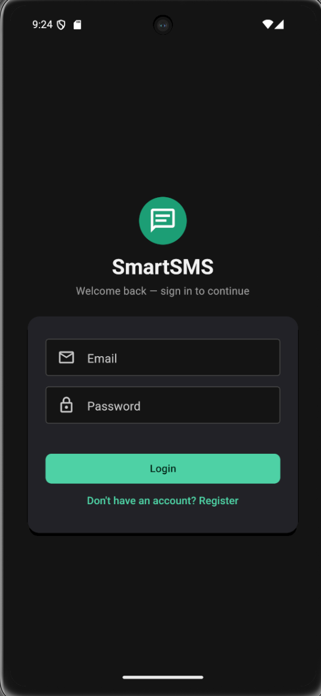
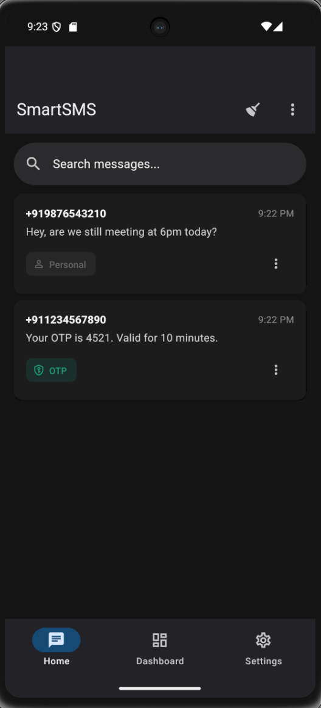
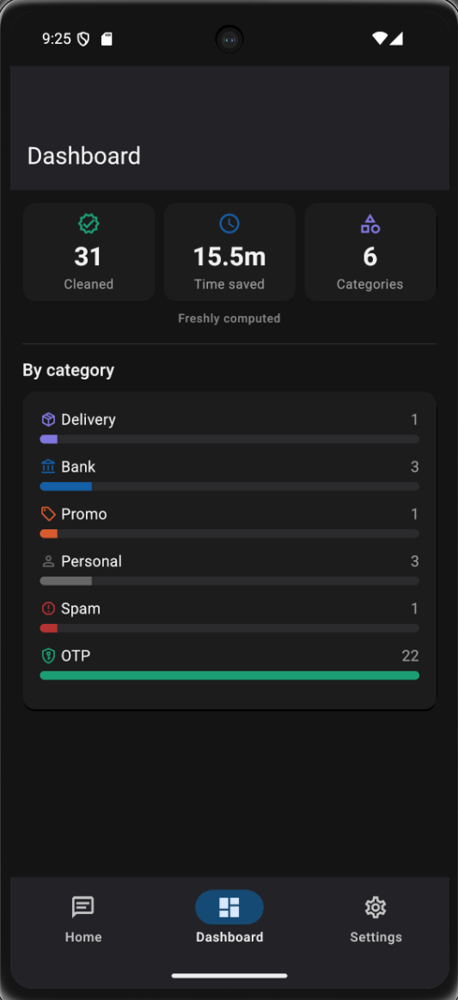
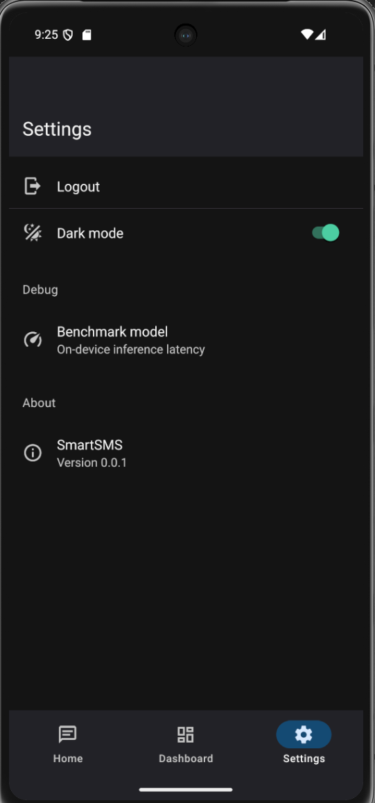

# SmartSMS

Privacy-first Android SMS manager that classifies every incoming message on-device with a fine-tuned DistilBERT model and auto-cleans expired OTPs — no message text ever leaves the phone.

**Live demo:** backend — `[backend URL placeholder]` · ai-service — `[ai-service URL placeholder]` · demo video — `[demo video placeholder]`

### Screenshots

| Login | SMS List | Dashboard | Settings |
|---|---|---|---|
|  |  |  |  |

---

## The Problem

SMS inboxes accumulate noise — OTPs, bank alerts, delivery updates, promo spam, and personal messages all sit in one flat list with no concept of category. OTPs are the worst offender: single-use and time-boxed, pure clutter the instant they expire, yet nothing on the platform ever removes them.

The obvious fix — "delete anything that looks like a 4–8 digit code" — fails in ways that compound:

- **Brittle.** A regex for `"Your OTP is 123456"` misses `"Your Uber code: 7716"` — real phrasing that never says "OTP".
- **Needs manual authoring.** Every sender has its own format; a rule set is stale the moment a new one appears.
- **Misses context.** The same digit pattern is a promo code, delivery ID, or bank PIN depending on the message.
- **Can't express uncertainty.** A regex matches or it doesn't — no way to say "70% confident" and let policy decide, which matters when the action is destructive.

This is a classification problem wearing a string-matching costume. Treating it as one — a model outputting a category *and* a confidence — is what the rest of this document is about.

---

## The Solution + Architecture

SmartSMS separates **perception** (what category is this?) from **policy** (what happens to it, and when?). On-device DistilBERT handles perception; a rule engine handles policy. The model never deletes anything; the rules never inspect message text.

```
┌───────────────────────────┐         ┌────────────────────────────────────┐
│   Android App              │         │   Backend (Docker Compose)          │
│   React Native 0.86 CLI    │  REST   │                                      │
│                             │  +JWT   │  ┌────────────────────────────┐    │
│  ┌───────────────────────┐ │◄───────►│  │ Node.js + Express (ESM)     │    │
│  │ TypeScript UI          │ │         │  │ auth+refresh · rules · sync │    │
│  └───────────┬────────────┘ │         │  │ feedback · analytics        │    │
│              │ bridge        │         │  └──────────────┬──────────────┘    │
│  ┌───────────▼────────────┐ │         │                 │                   │
│  │ Kotlin native module    │ │         │  ┌──────────────▼──────┐ ┌───────┐ │
│  │ SmsReceiver · SmsModule │ │         │  │      MongoDB          │ │ Redis │ │
│  │ WorkManager auto-clean  │ │         │  └────────────────────┘ └───┬───┘ │
│  │ TFLite inference ───────┼─┼── on-   │                              │      │
│  │  (WordPiece tokenizer)  │ │  device │  ┌────────────────────────┐ │      │
│  └─────────────────────────┘ │  only   │  │ FastAPI ai-service       │◄┘      │
│  On-device DistilBERT       │         │  │ /classify · /retrain     │       │
│  (SMS text never leaves)    │         │  └────────────────────────┘       │
└───────────────────────────┘         └────────────────────────────────────┘

Google Sign-In: app gets idToken from Google SDK → POST /api/auth/google
                → backend verifies with google-auth-library → issues own JWT
```

### Monorepo structure

```
app/
├── backend/      Node.js + Express (ESM) — auth, rules, sync, feedback, analytics
├── ai-service/   FastAPI (Python) — model serving + active-learning retrain pipeline
└── mobile/       React Native 0.86 CLI (not Expo) — UI + Kotlin native SMS module
docker-compose.yml   backend + ai-service + mongo + redis + redisinsight
```

`ai-service` serves `/classify` for retraining and batch work; the **on-device TFLite copy** classifies a user's actual messages, so no SMS content is transmitted for normal use. The backend only sees text a user explicitly submits as a feedback correction.

### The dual-layer design

```
SMS → ML classifies category (with confidence) → Rule engine decides action per category
```

ML handles perception, rules handle policy — user-editable, able to override the model. This mirrors production spam filters: a learned classifier feeding a deterministic policy layer, not one black box doing both.

---

## Tech Stack

| Layer | Technology | Why |
|---|---|---|
| Mobile | React Native 0.86 CLI, not Expo | Expo's managed workflow has no path to `content://sms` — SMS access needs native Android APIs. |
| SMS bridge | Custom Kotlin `@ReactMethod` module | Community RN SMS libraries are deprecated/unmaintained; a hand-built bridge avoids inheriting their bugs. |
| Backend | Node.js + Express 5 (ESM) | Familiar, fast to iterate, modern module syntax throughout. |
| Auth | JWT (access + refresh) + `google-auth-library` | Google auth uses the **idToken** flow — no web-redirect dance for a native app. |
| Queue | BullMQ + Redis | Decouples SMS ingestion from processing, with retry semantics for free. |
| Cache | Redis, same instance, second role | Doubles as BullMQ's broker and a cache-aside layer for `/analytics/summary` — read-heavy, write-light, staleness-tolerant: exactly a cache's use case, not worth a second system. |
| Database | MongoDB + Mongoose | Schema flexibility fits user-defined rules better than a rigid relational schema. |
| ML model | Fine-tuned DistilBERT → TFLite, fp32 | See [The Model Decision](#d-the-model-decision) — chosen over 4x-faster MobileBERT because it generalizes on the metric that matters. |
| ML serving | FastAPI (Python) | Async handling, Pydantic validation, auto OpenAPI docs, native fit with `transformers`. |
| Retrain trigger | Fire-and-forget `POST /retrain` | Backend doesn't wait on the result — feedback saves and the API succeeds even if `ai-service` is down. |
| Infra | Docker Compose | One command reproduces the full stack identically anywhere. |

---

## The ML Story

### a. Dataset design

~13,500 rows, 6 classes: `OTP`, `Bank`, `Promo`, `Delivery`, `Spam`, `Personal`.

| Source | Rows | Classes covered |
|---|---|---|
| UCI SMS Spam Collection | ~5,570 | Spam, Personal (ham) |
| Synthetic generator | ~8,500 | All six |
| — of which hard negatives | 1,500 | All six |

**Why synthetic.** No public dataset of Indian transactional SMS exists — UCI is a 2011-era UK personal-text corpus, binary spam/ham only, with **zero** representation for four of six target classes. Filled with `faker`-randomized entities (banks, merchants, couriers, amounts, dates).

The generator is adversarial against itself: **noise injection** (case flips, `your`→`ur`, stripped punctuation, `Rs.`/`INR`/`₹`, trailing `T&C apply`); **keyword-free OTP templates** (`"Your Uber code: 7716"`) so the model can't string-match "OTP"; **1,500 hard negatives** — messages whose bag-of-words looks like one class but isn't:

| Text | True label | A keyword rule would say |
|---|---|---|
| `Use code 4821 at checkout for 25% off` | Promo | OTP (digits + "code") |
| `Never share your OTP, PIN or CVV. HDFC never asks.` | Bank | OTP (contains "OTP") |
| `Bro send me Rs.500 on gpay` | Personal | Bank (contains amount) |
| `Dear customer ur HDFC account will be blocked! bit.ly/x` | Spam | Bank (contains bank name) |

Every synthetic row carries a `template_id` (e.g. `OTP_7`) marking which template family produced it — the field that makes the evaluation methodology below possible.

### b. Why ML over regex

Regex handles the templated majority — exactly what the background auto-clean worker uses, on purpose (see [Key Design Decisions](#key-design-decisions)). It fails where the hard-negatives table lives: phrasing without the keyword, ambiguous digits, permanent maintenance per new sender. A learned model captures the *concept*, expresses it as a confidence instead of a boolean, and improves from real usage via active learning instead of a human writing a new rule per bank.

### c. Evaluation methodology

```
full dataset
├── holdout families (~15% of template families)  → holdout.csv   [evaluated once, never seen]
└── pool = remaining templates + all UCI rows
        ├── 70% train.csv · 15% val.csv (early stopping) · 15% test.csv (standard metrics)
```

Standard split answers *"how good overall?"* Template holdout answers *"does it generalize, or memorize the generator's skeletons?"* A random row-level split **leaks templates** — the same skeleton with different slot values lands on both sides, crediting memorized structure over concept. Holding out whole families closes that leak, and influences **no** training decision — the moment it did, it would stop measuring generalization.

### d. The model decision

MobileBERT was benchmarked as a latency challenger, evaluated identically:

| Metric | DistilBERT | MobileBERT |
|---|---|---|
| Params | 66M | 25M (factorized embedding) |
| On-device latency (p50) | 138 ms | ~50 ms (4x faster) |
| Standard test OTP recall | 100% | 100% |
| **Holdout OTP recall** | **100%** | **67%** (309/461) |
| Holdout macro-F1 | **0.9021** | ~0.72 |

MobileBERT was 4x faster but **missed 1 in 3 OTPs on unseen formats** — it memorized templates rather than learning the concept. For an app whose entire purpose is auto-deleting OTPs, a false negative is the core failure mode. DistilBERT held 100% OTP recall even on templates never seen.

**Decision: ship DistilBERT.** OTP recall on held-out templates is the business-critical metric, not aggregate accuracy or raw speed — the extra ~88 ms is imperceptible for a background classification. The threshold was pre-committed, not adjusted after seeing which model "felt" better.

### e. Active learning loop

Even DistilBERT drops ~9 F1 points from standard-test to holdout — a real, quantified synthetic-to-real gap. User corrections are, by definition, the out-of-distribution cases the model got wrong — the most sample-efficient way to close it.

```
User taps correct category → backend stores correction, counts pending
        → threshold reached → fire-and-forget POST /retrain to ai-service
        → FastAPI background task: fetch feedback → tokenize → fine-tune → save new versioned model
```

The data flywheel: more usage → more corrections → better model → better UX → more usage. Feedback stores a SHA-256 hash plus raw text (needed for retraining, collected with the correction); the trigger is non-blocking because training takes minutes.

### f. Quantization note

int8 is a release requirement, not an optimization — at 255 MB the fp32 model exceeds the Play Store's 200 MB base-APK limit. Five conversion routes were attempted, all blocked by the same constraint: TFLite's `EMBEDDING_LOOKUP` kernel requires symmetric quantization (`zero_point == 0`), and DistilBERT's word-embedding table (23.4M of 66M params) is exactly the tensor carrying it. `litert-torch`'s PT2E dynamic int8 doesn't guarantee that and fails at `allocate_tensors()`; excluding just the embedding layer has no effect since `torch.export` flattens modules before the quantizer sees them; `onnx2tf` routes need calibration data (wrong variant) or a SavedModel intermediate its fast path doesn't produce.

fp32 shipped after confirming bit-exact PyTorch parity (16/16, max logit diff 0.0). The correct fix is **quantization-aware training** with the embedding kept in float, or MobileBERT's factorized embedding, at the generalization cost documented above.

---

## Hard-Won Engineering Challenges

**a. Making the app Android's default SMS handler.** Requires four declared components — `SMS_DELIVER` receiver, `WAP_PUSH_DELIVER` receiver, `RESPOND_VIA_MESSAGE` service, `SENDTO` filters. All four confirmed present via `dumpsys package`, yet the app wouldn't appear in the SMS picker. Root cause: the `SENDTO` filters were missing `<category android:name="android.intent.category.DEFAULT"/>`. Role-qualification resolves that filter like an implicit intent, which requires `CATEGORY_DEFAULT` — but `dumpsys` lists a filter regardless of its categories, so the manifest *looked* complete while failing the real check. Diagnosed by forcing a role assignment (`cmd role add-role-holder`) and reading the rejection in `logcat`.

**b. int64 vs int32 TFLite inputs.** Inference threw `Cannot copy to TFLite tensor with 512 bytes from Java Buffer with 256 bytes` — the model expects int64 inputs (64×8=512), the Kotlin buffer wrote int32 (64×4=256). Fixed with an 8-byte `LongBuffer`.

**c. int8 quantization blocked.** Full detail in [ML Story §f](#f-quantization-note) — five routes, all blocked by `EMBEDDING_LOOKUP`'s `zero_point==0` constraint. fp32 shipped; QAT is the correct future path.

**d. MobileBERT gradient explosion.** Its fresh classifier head produced 8-million initial loss on the pre-training overfit sanity check (should reach ~0) — larger init variance than DistilBERT's, standard LR too aggressive. Fixed with tighter clipping (0.5 vs 1.0), lower LR (1e-5 vs 5e-5), 200 warmup steps vs 60; the real run uses `warmup_ratio=0.1` with a cosine schedule instead.

**e. ESM + dotenv hoisting.** `process.env` came back `undefined` in routes despite `dotenv.config()` running first — ES `import` is hoisted above all top-level code, so routes read `process.env` before dotenv populated it. Resolved via Docker's `env_file` injecting variables before Node starts.

**f. Tokenizer parity.** TFLite bundles no tokenizer, so the WordPiece tokenizer is hand-written in Kotlin, reading `vocab.txt` from assets. Verified by comparing the first 12 token IDs for identical strings on both sides — an exact match confirmed correct on-device inputs.

**g. RN 0.86 permission timing.** Requesting SMS permissions in a plain `useEffect` on mount threw `Tried to use permissions API while not attached to Activity` — the Activity isn't guaranteed attached on first render. Fixed with `InteractionManager.runAfterInteractions`.

**h. DistilBERT vs MobileBERT — the decision, made twice.** Switched to MobileBERT first, purely on the 50ms-vs-138ms win, reverted after template-holdout exposed 67% OTP recall on unseen formats ([§d](#d-the-model-decision)). Right the second time because it followed a metric threshold checked *after* implementing the challenger, not intuition going in.

**i. Feedback service auth gap.** `ai-service`'s retrain pipeline calls `/api/feedback/pending` with no user context — a service call a JWT doesn't fit. First left unauthenticated, reasoning "internal Docker network only" — a privacy leak waiting for the topology to change. Fixed with a shared `INTERNAL_SERVICE_TOKEN` header checked server-side.

---

## Build Journey (Days 1–20)

**Phase 1 — Backend (Days 1–4).** Monorepo + Docker Compose + JWT auth (register/login/refresh with rotation) + Google OAuth via mobile idToken. SMS rule schema, full CRUD, pagination, delta sync. Rule engine wired to BullMQ + Redis. Device registration, server-side `lastSyncAt`, centralized error handling.

**Phase 2 — Android app (Days 5–8).** Custom Kotlin SMS module (`SmsModule`, `SmsPackage`, `SmsReceiver`) replacing deprecated libraries. MMKV local caching behind a repository pattern. Axios client with JWT interceptor and 401 auto-refresh with request queuing. WorkManager auto-clean scheduler and the default-SMS-app implementation (hardest problem in this phase), plus real-time updates via `DeviceEventEmitter`.

**Phase 3 — ML (Days 9–13).** Dataset design + EDA: UCI plus synthetic generator with noise injection, hard negatives, `template_id` tracking. DistilBERT fine-tuning with class-weighted cross-entropy, two-level split, sanity checks. TFLite export via `litert-torch`, fp32, bit-exact parity; int8 blocked. FastAPI `ai-service` with singleton model load, batch inference. On-device Kotlin inference: hand-written tokenizer, `SmsClassifier`, latency benchmarking, the DistilBERT-vs-MobileBERT decision.

**Phase 4 — MLOps (Days 14–15).** Active-learning loop: correction endpoint, hashed feedback storage, threshold-triggered fire-and-forget retrain, background-task fine-tuning verified end-to-end in logs. OTA model delivery designed (champion/challenger with an OTP-recall guardrail) but deferred.

**Phase 5 — Polish (Days 16–20).** Per-user analytics dashboard: MongoDB aggregation behind a Redis cache-aside layer, 5-minute TTL, invalidated on write. Material Design 3 UI pass including dark mode. Security hardening: Helmet, rate limiting, Mongo sanitization, internal service token. Deployment packaging and this document.

---

## Key Design Decisions

| Decision | Why |
|---|---|
| On-device inference for privacy | Privacy is architectural, not a policy promise — SMS never leaves the phone for normal classification. |
| Regex for background auto-clean, ML for foreground | The battery-sensitive background worker stays on cheap pattern matching; the transformer runs on foreground categorization, cached so each message is classified once. |
| Delta sync, server-owned `lastSyncAt` | Server is the single source of truth, avoiding client-clock drift bugs. |
| Refresh-token rotation with reuse detection | Reuse of an already-rotated token signals theft and invalidates the session. |
| Google OAuth via idToken, not web redirect | The SDK hands the app a signed idToken; the backend just verifies it — no server-mediated redirect. |
| Fire-and-forget retrain trigger | Feedback saves and the API succeeds even if ai-service is down. |
| Classify-once, then cache | Inference cost bound to *new* messages only. |
| Rate limiting on an in-memory store | Correct for one backend instance; documented gap for a shared Redis store past that. |

---

## Security

Helmet globally. Rate limiting: `authLimiter` 10 req/15min on register/login/google/refresh, `generalLimiter` 100 req/15min elsewhere. Mongo sanitization via custom middleware (Express 5 makes `req.query` a read-only getter, so the library's default assignment throws — fixed with `Object.defineProperty`). CORS restricted via `ALLOWED_ORIGINS`. Input validation on register and feedback labels. Internal service token on the feedback routes ai-service calls with no user JWT. Log hygiene — no SMS bodies or tokens logged. Retrain cooldown: 5 minutes. Production startup warns on short JWT secrets.

**Known gaps:** certificate pinning deferred (networking goes through Axios/JS, not a custom OkHttp client — pinning needs the native layer; see `app/mobile/README.md`). Rate limiting needs a shared Redis store past one backend instance.

---

## Testing Methodology

### Manual verification matrix

| Area | Verified |
|---|---|
| Auth flows | Register, login, refresh rotation, reuse detection (403 on reused token) |
| Rate limiting | 11th request in a 15-min window returns 429 |
| Internal service token | `/feedback/pending` → 403 without header, 200 with |
| Feedback → retrain trigger | Crossing `RETRAIN_THRESHOLD` fires `POST /retrain`, confirmed in logs |
| Retrain end-to-end | Fetch → tokenize → fine-tune → save checkpoint, confirmed to convergence |
| Default SMS app role qualification | Confirmed via `dumpsys package` and `cmd role add-role-holder` |
| Analytics cache lifecycle | Miss computes+populates, hit skips MongoDB, write invalidates, TTL atomic via `setex` |

### ML evaluation (design, not manual testing)

Template-holdout methodology (§ML Story c), OTP recall as the primary metric rather than macro-F1 (a false negative's cost isn't symmetric with other errors), and the DistilBERT/MobileBERT A/B decided on holdout numbers, not the standard-test numbers where both looked equally good.

**Note on automated tests:** a Jest/Supertest suite covering auth and rule CRUD is planned — deprioritized in favor of end-to-end functionality and ML rigor, where the real risk in this project lives.

---

## Quick Start

**Prerequisites:** Docker + Docker Compose, Node.js ≥ 22.11, Android Studio/SDK with `adb` on `PATH`, an emulator or device with Google Play services.

```bash
# Backend + services
docker compose up --build
# backend → localhost:3000 · ai-service → localhost:5000
# mongo → localhost:27018 · redis → localhost:6379 · redisinsight → localhost:5540

# Mobile (from app/mobile)
npx react-native run-android 
```

**Common issues:** `adb` needs `platform-tools` on `PATH`. Emulator reaches the backend at `10.0.2.2:3000` (host-loopback), not `localhost`. `.env` values need no quotes/spaces around `=`. Run React Native/adb from the host shell, not WSL.

---

## Running in Production

### Environment variables

| Variable | Purpose | Secret? |
|---|---|---|
| `PORT` | Backend listen port | No |
| `MONGO_URI` | MongoDB connection string | Yes |
| `JWT_SECRET` / `JWT_REFRESH_SECRET` | Sign access/refresh tokens (≥32 chars in prod) | Yes |
| `JWT_EXPIRES_IN` / `JWT_REFRESH_EXPIRES_IN` | Token lifetimes | No |
| `GOOGLE_CLIENT_ID` / `GOOGLE_CLIENT_SECRET` | Google idToken verification | `CLIENT_SECRET` yes |
| `REDIS_HOST` / `REDIS_PORT` | Shared by BullMQ and analytics cache | No |
| `ALLOWED_ORIGINS` | CORS allowlist | No |
| `INTERNAL_SERVICE_TOKEN` | ai-service ↔ backend feedback calls | Yes |
| `NODE_ENV` | Enables production-only checks | No |
| `BACKEND_URL` / `AI_SERVICE_URL` | Cross-service reachability | No |

**Docker Compose services:** `backend`, `ai-service`, `mongo:7`, `redis:7-alpine`, `redisinsight` (optional inspection UI).

**Known production gaps:** certificate pinning; rate-limit store needs Redis past one instance; retrain shares the `ai-service` container with `/classify`, competing for CPU — should be a dedicated worker at scale.

---

## Known Limitations / Future Work

- **OTA model delivery** — champion/challenger deployment with an OTP-recall guardrail (a challenger only promotes if it doesn't regress OTP recall) is designed but not implemented. The guardrail design is the interesting part, not the delivery mechanics.
- **Google Sign-In on mobile** — backend endpoint complete and tested via curl; the mobile SDK integration isn't wired into the app UI yet.
- **Label-cache miss on correction** — the backend record updates correctly, but the on-device cached label isn't consistently refreshed in real time; under investigation.
- **Automated test suite** — Jest/Supertest for auth and rule CRUD, planned, not yet written.
- **Certificate pinning** — deferred pending a move off Axios/JS to a custom OkHttp client.
- **Retrain worker separation** — currently shares the `ai-service` container with live inference; would split at scale.
- **Federated learning** — retraining without ever centralizing corrected message text — a stronger privacy guarantee than the current hash-plus-consent model.

---

## Interview Preparation Notes

<details>
<summary><strong>"Walk me through the architecture"</strong></summary>

Three services: an RN Android app with a custom Kotlin SMS module, a Node/Express backend for auth and rule sync, and FastAPI for model serving/retraining. The core decision is separating classification from policy — DistilBERT, exported to TFLite, runs on-device with a confidence score; a separate rule engine decides what happens to that category, and when. That's what makes the privacy story real: message text never has to touch the network for the app's core function.

</details>

<details>
<summary><strong>"What was the hardest engineering problem?"</strong></summary>

Getting recognized as Android's default SMS handler (full writeup in [§a](#hard-won-engineering-challenges)). All four required manifest components were confirmed present via `dumpsys package`, yet the app wouldn't appear in the picker — the `SENDTO` filters were missing `CATEGORY_DEFAULT`, which `dumpsys` doesn't check for but Android's actual role resolution does. Found by forcing a role assignment and reading the rejection in `logcat`. Lesson: when your diagnostic tool isn't validating the same thing as the real check, it lies to you confidently.

</details>

<details>
<summary><strong>"How did you choose DistilBERT over MobileBERT?"</strong></summary>

Chose MobileBERT first, purely on its ~4x latency win (numbers in [§d](#d-the-model-decision)). A template-holdout evaluation showed it had memorized templates rather than learned the concept: 100% OTP recall on the standard test set, 67% on holdout, vs DistilBERT's 100% on both. Reverted, accepting ~88ms extra latency, imperceptible for a background classification. The point: the decision followed a metric threshold committed to before running the comparison, on the one class where an error is expensive.

</details>

---

## About / Contact

# Shashikanth K

**M.Tech, Computer Science, IIT Kanpur**

- **Email:** shashikanthk80@gmail.com
- **LinkedIn:** https://www.linkedin.com/in/shashikanth-kungulwar-8abb53368
- **Portfolio:** https://your-portfolio-url.com